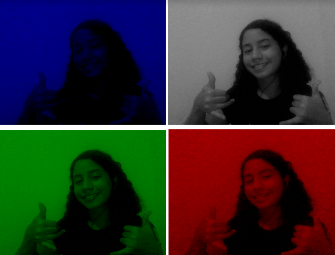

# camera-capture--manipulation

<!DOCTYPE html>
<html lang="en">
  
<body>
<h1>OpenCV Program: Webcam Frame Capture and Manipulation</h1>

This OpenCV program is designed to capture a frame of video from the computer's webcam, display different versions of this frame in separate windows, and save both the original frame and the modified versions in grayscale, red, green, and blue as PNG images.

<h2>Challenge:</h2>

This OpenCV program is designed to accomplish the following tasks:

<ol>
  <li><strong>Capture a frame from the webcam video:</strong></li>
  <li><strong>Display different versions of the frame in separate windows:</strong>
    <ul>
      <li>a) in grayscale</li>
      <li>b) in red</li>
      <li>c) in green</li>
      <li>d) in blue</li>
    </ul>
  </li>
  <li><strong>Save the captured original frame and the modified frames as PNG images.</strong></li>
  <li><strong>Remember to always release resources at the end.</strong></li>
</ol>

<h2>Features:</h2>
<ol>
<li><strong>Webcam Frame Capture:</strong> Utilizes the <code>cv2.VideoCapture()</code> function to initiate video capture from the computer's webcam. It then reads a frame of video using <code>cam.read()</code>.</li>

<li><strong>Display of Modified Frame Versions:</strong>
   <ul>
   <li><strong>Grayscale:</strong> Converts the original frame to a grayscale version using <code>cv2.cvtColor()</code>.</li>
   <li><strong>Red, Green, and Blue:</strong> Splits the original frame into its RGB color components and displays each component in a separate window.</li>
   </ul>
</li>

<li><strong>Saving Frames as PNG Images:</strong> Utilizes <code>cv2.imwrite()</code> to save the original frame and the modified versions as PNG format images.</li>

<li><strong>Resource Release:</strong> Closes all opened windows and releases the webcam resources using <code>cam.release()</code>.</li>
</ol>

<strong>How to Use:</strong>

<ul>
<li>Make sure you have the OpenCV library installed in your Python environment.</li>
<li>Execute the program in a compatible Python environment.</li>
<li>Adjust the webcam to point to the scene you wish to capture.</li>
<li>Wait for the windows displaying the different frame versions and the saved images in PNG format.</li>
</ul>

<strong>Note:</strong> The <code>cv2.waitKey(0)</code> will pause your code run until you press any key with the image window opened.

<strong>Result:</strong>

  
  

</body>
</html>
